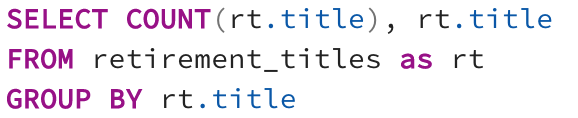
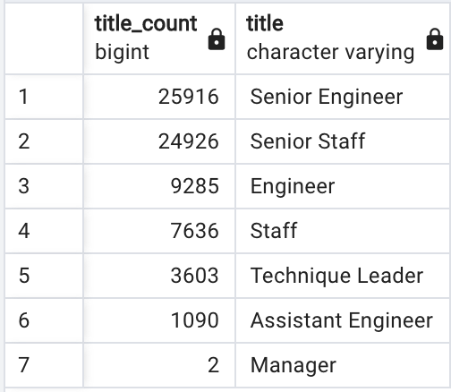
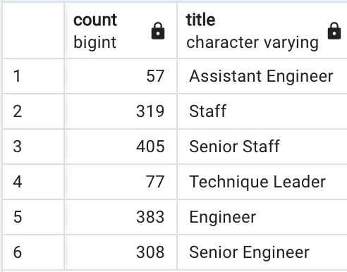
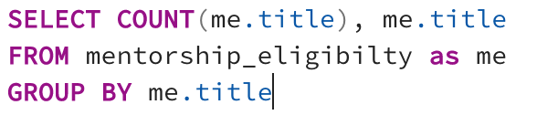

# Pewlett-Hackard-Analysis

## Overview of the analysis
The purpose of this analysis is to help the Company Pewlett Hackard answer those question: 
- Who will be retiring in the next feel years?
- Which retirement packages for those who meet certain criteria?
- How many positions will Pewlett Hackard need to fill?
Furthermore the analysis will help the company to deal with the "silver tsunami" as there are many employees approaching retirement.

## Resources
- Data: retirement_titles.csv, employees.csv, titles.csv, unique_titles.csv, mentorship_eligibilty.csv,
dept_emp.csv.
- Software: SQL

## Results
- The first observation is that the number of employees retiring is approximately 70k, as seen in the retiring_titles table.
- In addition, most employees retiring are in senior roles, precisely senior engineer and senior staff. This scenario can lead to a loss of internal processes, engineering documentation, and strategic vision, in addition to impacting the company's performance in defect rate.
- But this is an excellent opportunity for the company to recognize employees who see themselves as standing out and being promoted to senior positions, which can be seen as a new phase of the company.
- In the second delivery of the analysis, it is possible to visualize the employees who are ready for the mentorship program. It does not equate to the number of people retiring, but it reduces the company's impact. The positions with the readiest employees are Senior Staff and Senior engineer.

## Summary
- How many roles will need to be filled as the "silver tsunami" begins to make an impact?
There will be 72,458 roles that will have to be filled from seven different areas

.

.

- Are there enough qualified, retirement-ready employees in the departments to mentor the next generation of Pewlett Hackard employees?
There are not enough employees to mentor the next generation. More than 70 thousand employees are retiring, with less than 3 thousand qualified employees.

.

.
